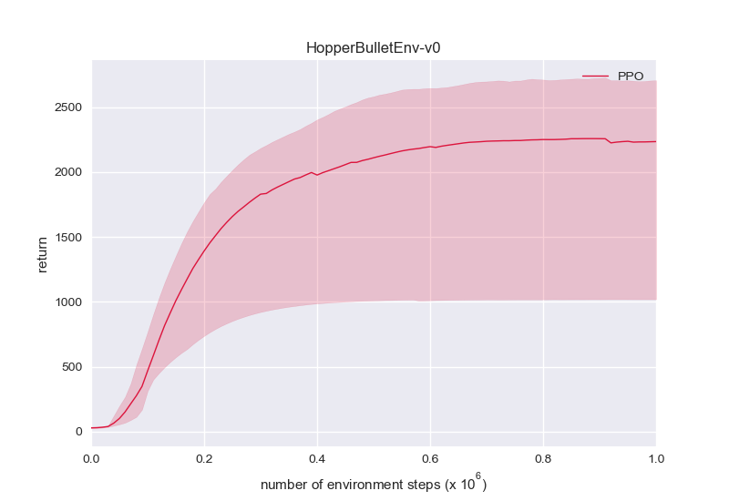
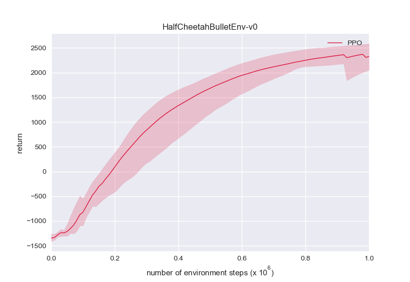
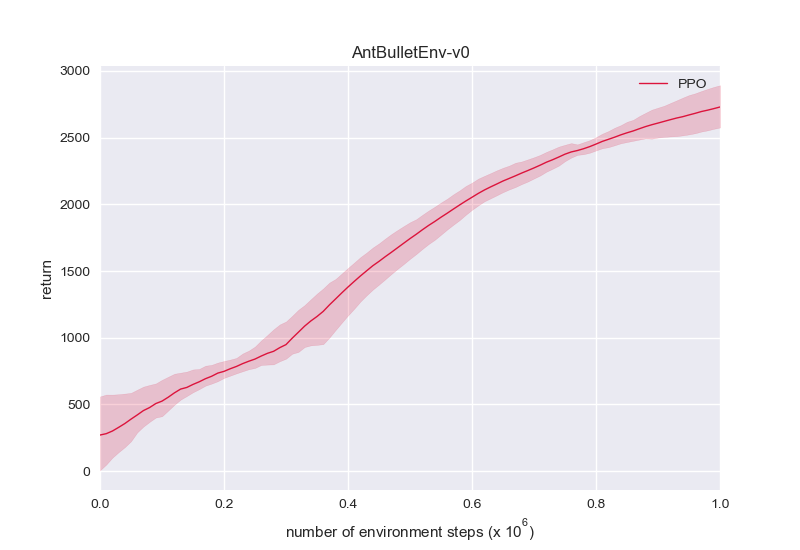

# SimplyPPO: A Minimal Proximal-Policy-Optimization PyTorch Implementation

SimplyPPO replicates PPO with minimum (~250) lines of code in clean, readable PyTorch style, while trying to use as few additional tricks and hyper-parameters as possible.

## Implementation details:
* Advantage and state normalization.
* Gradient clipping.
* Entropy bonus.
* Tanh squashing to ensure action bounds and log_std clamping (as in SAC).

That's it! All other things follow the original paper.

Also check out [SimplySAC](https://github.com/arthur-x/SimplySAC), a minimal Soft-Actor-Critic PyTorch implementation.

> NOTE: This is a single-threaded PPO implementation for continuous control tasks. The particular implementations of state normalization are adopted from [here](https://github.com/Lizhi-sjtu/DRL-code-pytorch/tree/main/5.PPO-continuous), where various other tricks are also discussed.

## PyBullet benchmarks:

You can find the performance of Stable Baselines3 [here](https://stable-baselines3.readthedocs.io/en/master/modules/ppo.html#pybullet-environments) as a reference.








These figures are produced with:

* One evaluation episode every 1e4 steps.
* 5 random seeds, where the mean return is represented by the solid line, and max/min return by the shaded area.

To execute a single run:
```
python learn.py -g [gpu_id] -e [env_id] -l [log_id]
```

Experiments use `pybullet==3.0.8`.